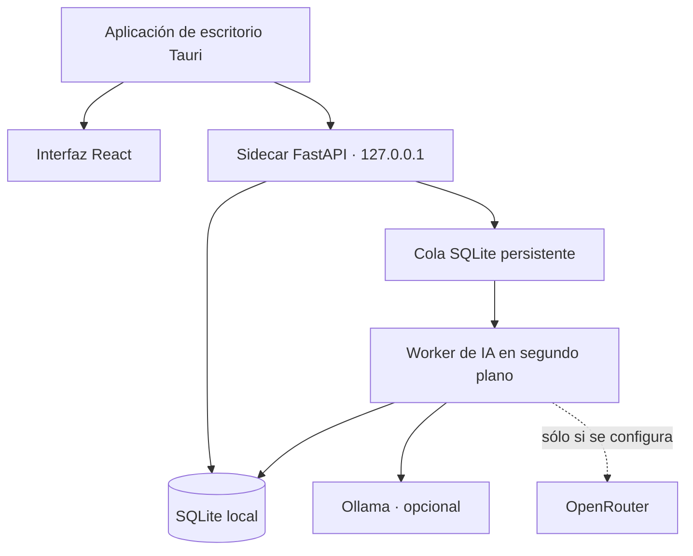

<p align="center">
  
</p>

<p align="center">
  <a href="README.md">English</a> · <a href="README.es.md">Español</a>
</p>

<h1 align="center">EmoVest</h1>

<p align="center">
  <strong>El diario de trading open source y local-first para entender tu rendimiento, tus emociones y tu forma de operar.</strong>
  <br>
  Entiende no sólo cómo operas, sino por qué operas de esa manera.
</p>

<p align="center">
  <a href="https://github.com/ELROKA02/EmoVest/releases/latest/download/EmoVest-Setup.exe"></a>
  <a href="https://github.com/ELROKA02/EmoVest/releases/latest"></a>
</p>

<p align="center">
  <a href="https://github.com/ELROKA02/EmoVest/releases"></a>
  <a href="https://github.com/ELROKA02/EmoVest/actions/workflows/desktop-windows.yml"></a>
  <a href="LICENSE"></a>
  
  
</p>

> EmoVest no da señales ni asesoramiento financiero. Es un espacio privado para revisar, entender y mejorar tu propio proceso.

## Mira EmoVest en acción

<p align="center">
  <a href="docs/Video_presentacion.mp4">
    
  </a>
</p>

<p align="center">
  <a href="docs/Video_presentacion.mp4">Ver la demo completa del producto</a>
</p>

## ¿Por qué EmoVest?

Un historial de operaciones explica qué hizo el precio. Rara vez explica qué ocurrió contigo: el miedo, la duda, la euforia o el exceso de confianza detrás de una decisión.

EmoVest mantiene la operación y su contexto humano en el mismo lugar. Revisa tus resultados con evidencia —no con memoria selectiva— y descubre los patrones de comportamiento que afectan a tu proceso.

| En vez de… | Con EmoVest puedes… |
| --- | --- |
| Hojas de cálculo, historial del bróker y notas dispersas | Reunir operaciones, métricas, capturas y contexto en un único diario |
| Considerar cada error una mala racha | Comparar resultados con la confianza y el contexto emocional que registraste |
| Enviar notas sensibles a un servicio cloud por defecto | Elegir análisis local con Ollama o configurar expresamente un proveedor remoto |

## Diseñado para tu proceso de trading

- **Diario completo** — Registra operaciones LONG y SHORT, riesgo, confianza, notas, comisiones y capturas.
- **Revisión de rendimiento útil** — Consulta beneficio neto, win rate, drawdown, rachas y rendimiento diario por cuenta.
- **Contexto emocional** — Convierte las notas de tus operaciones en insights emocionales orientativos, siempre junto a los datos de la operación.
- **EVA** — Explora tu diario y tus hábitos mediante una conversación más natural.
- **Tus datos, tus decisiones** — Importa y exporta datos CSV cuando lo necesites.

## Tus datos de trading te pertenecen

| Área | Cómo lo gestiona EmoVest |
| --- | --- |
| Operaciones, capturas y estadísticas | Se almacenan y calculan localmente en tu equipo |
| Cambios en la base de datos | Se crean copias de seguridad antes de las migraciones y fuera de la carpeta de instalación |
| API de escritorio | Se ejecuta en `127.0.0.1` y usa un token generado para la sesión de escritorio |
| EVA con Ollama | Se procesa localmente cuando eliges un modelo local |
| EVA con OpenRouter | Sólo se envía cuando configuras OpenRouter expresamente y proporcionas tu propia clave |
| IA | Es opcional; el diario y las estadísticas funcionan sin ella |

El análisis emocional es una interpretación orientativa de tus notas. Sirve para reflexionar; no sustituye tu criterio ni ofrece recomendaciones de inversión.

## Tú eliges cómo usar la IA

| Si prefieres… | Puedes usar… |
| --- | --- |
| Análisis que permanezca en tu equipo | **Ollama** con un modelo local |
| Un modelo remoto bajo tu control | **OpenRouter** con tu propia API key |
| Herramientas distintas para tareas distintas | Proveedores separados para el análisis emocional y EVA |

## Empieza en tres pasos

1. [Descarga EmoVest para Windows](https://github.com/ELROKA02/EmoVest/releases/latest/download/EmoVest-Setup.exe).
2. Ejecuta `EmoVest-Setup.exe` y completa el instalador.
3. Crea una cuenta y registra tu próxima operación con todo su contexto.

No necesitas Python, Docker, MySQL, Redis ni Node.js. Tus datos se guardan fuera de la carpeta de instalación y se conservan cuando actualizas o reinstalas EmoVest.

## Arquitectura



Al crear una operación, EmoVest la guarda primero; el análisis emocional se ejecuta en segundo plano para no interrumpir tu flujo.

## Desarrollo

Consulta [la guía de escritorio para Windows](docs/escritorio-windows.md) para conocer la arquitectura, las rutas de datos, las copias de seguridad, las actualizaciones y la validación.

```powershell
cd backend
python -m venv venv
.\venv\Scripts\python.exe -m pip install -r requirements.txt

cd ..
.\scripts\build-windows-sidecar.ps1

cd frontend
pnpm install
pnpm desktop:dev
```

## Roadmap y contribuciones

EmoVest se construye en abierto. Consulta el [roadmap público](ROADMAP.md), explora las [issues abiertas](https://github.com/ELROKA02/EmoVest/issues) y lee [CONTRIBUTING.md](CONTRIBUTING.md) cuando quieras colaborar.

Son especialmente bienvenidas las contribuciones que mejoren la experiencia, la accesibilidad, la privacidad, la documentación, las pruebas o el análisis responsable.

## Apoya EmoVest

Si EmoVest te ayuda a revisar tu operativa con más perspectiva, puedes ayudar a que el proyecto siga avanzando:

- [Patrocina EmoVest en GitHub Sponsors](https://github.com/sponsors/ELROKA02)
- [Invítame a un café](https://buymeacoffee.com/elroka02)

## Licencia

EmoVest se publica bajo la [licencia MIT](LICENSE).
