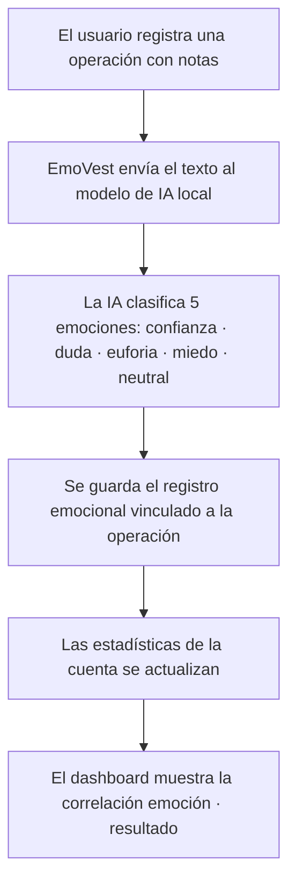

# 🧠 EmoVest — Emotional Invest

EmoVest convierte el diario de trading en inteligencia emocional accionable. Registra tus operaciones, escribe cómo te sientes y la IA detecta qué emociones están afectando tus decisiones.

---

## 🎯 El Problema

La mayoría de los traders no pierden por falta de estrategia. Pierden porque operan con miedo, euforia o exceso de confianza y no lo saben hasta que ya es tarde.

EmoVest cuantifica lo que hasta ahora era intangible: **tu estado emocional en cada operación**.

---

## ⚡ Qué hace EmoVest

EmoVest combina un gestor de operaciones de trading con un motor de análisis emocional basado en IA local. Cada vez que registras una operación con notas, EmoVest clasifica automáticamente tu estado emocional en cinco dimensiones y lo almacena vinculado al resultado financiero.

---

## 🧠 Cómo funciona

1. El usuario crea una cuenta de trading y registra sus operaciones (LONG/SHORT).
2. Al añadir notas a una operación, EmoVest lanza el análisis emocional automáticamente.
3. El modelo de IA local clasifica el texto en cinco emociones con porcentaje de presencia.
4. El registro emocional queda vinculado a la operación y a su resultado financiero.
5. Las estadísticas de la cuenta recogen profit total, ratio R/R, drawdown y más.

---

## 🛠️ Stack Tecnológico

| Capa | Tecnología |
|------|-----------|
| Frontend | React 18 + Vite + Tailwind CSS |
| Backend | FastAPI + SQLAlchemy 2.0 |
| Base de datos | MySQL (PyMySQL) |
| Autenticación | JWT (python-jose + bcrypt) |
| IA emocional | Ollama (modelo local `clasificador_texto`) |
| Validación | Pydantic v2 |

---

## 🚀 Funcionalidades

- Registro e inicio de sesión con autenticación JWT
- Gestión de múltiples cuentas de trading por usuario (EUR / USD)
- Registro de operaciones LONG y SHORT con stop loss, take profit, ratio R/R y nivel de confianza
- Adjuntar screenshot a cada operación
- **Análisis emocional automático** al registrar notas: confianza, duda, euforia, miedo y neutral
- Estadísticas por cuenta: total de operaciones, ganadoras, perdedoras, profit total, profit promedio, max drawdown y ratio R/R promedio
- Sistema de suscripciones con planes FREE, PRO y PARTNER
- Sistema de trofeos y logros por actividad
- Notificaciones por usuario

---

## 👥 Equipo

| Nombre | Rol | GitHub |
|--------|-----|--------|
| Annabel | Frontend | @Annabel707 |
| Enrique | Frontend | @3gr00 |
| Alejandro | Backend | @21AlexMedina |
| Samuel | Backend | @ELROKA02 |

---

## ⚠️ Aviso

EMOVEST no proporciona asesoramiento financiero.  
Es una herramienta de análisis conductual y estadístico.
