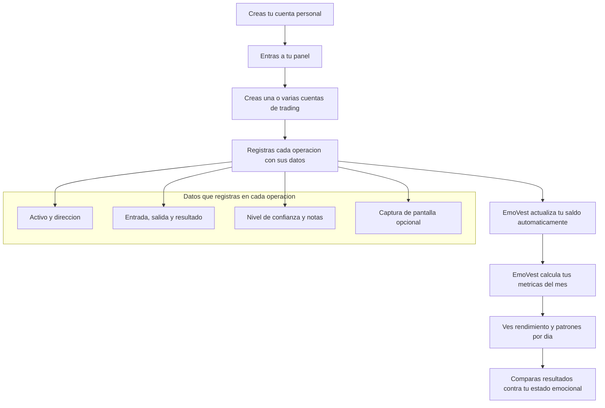
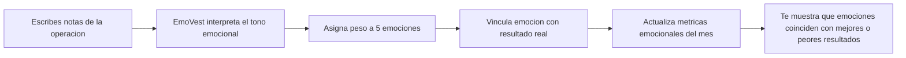

EmoVest convierte el diario de trading en inteligencia emocional accionable. Registra tus operaciones, escribe cómo te sientes y la IA detecta qué emociones están afectando tus decisiones.

https://github.com/user-attachments/assets/7aa16d35-055a-4fea-b33c-defe37a71cf4

---

## 🎯 El Problema

La mayoría de traders mide precio y riesgo, pero no mide su estado mental al decidir. Sin ese dato, repiten sesgos con apariencia de estrategia.

EmoVest cuantifica lo que hasta ahora era intangible: **tu estado emocional en cada operación**.

---

## ⚡ Qué hace EmoVest

Un **diario de trading** es el registro sistemático de cada operación: activo, dirección (LONG/SHORT), precio de entrada y salida, resultado, notas y contexto. Los traders profesionales lo usan para identificar errores repetidos y mejorar su proceso de decisión con datos reales en lugar de intuición.

EmoVest hace eso, y va un paso más allá: cada vez que escribes notas en una operación, **un modelo de IA local analiza el texto y cuantifica tu estado emocional** en cinco dimensiones. El resultado queda vinculado al resultado financiero, convirtiendo el diario en un espejo psicológico de tu trading.

---

## 🧠 Cómo funciona

### Flujo general de EmoVest

### Flujo emocional (cuando escribes notas)

1. Creas tu perfil e inicias sesion para acceder a tu espacio de trabajo.
2. Registras una o varias cuentas de trading segun tu forma de operar.
3. Guardas cada operacion con contexto completo para construir tu diario.
4. EmoVest recalcula tu saldo y tus metricas cada vez que actualizas resultados.
5. Si añades notas, EmoVest analiza la parte emocional y la cruza con tu rendimiento.
6. En estadisticas, puedes filtrar por cuenta, mes y ano para detectar patrones de mejora.

---

## 🛠️ Stack Tecnológico

| Capa | Tecnología |
|------|-----------|
| Frontend | React 18 + Vite + Tailwind CSS |
| Backend | FastAPI + SQLAlchemy 2.0 |
| Base de datos | MySQL (PyMySQL) |
| Autenticación | JWT (python-jose + bcrypt) |
| IA emocional | Ollama (modelo local `clasificador_texto`) |
| Validación | Pydantic v2 |

---

## 🚀 Funcionalidades

### Cuenta y acceso

- Puede crear su cuenta personal con plan inicial y entrar en segundos.
- Puede mantener la sesion activa para volver sin repetir el correo cada vez.
- Puede ver su perfil con nombre y correo dentro del panel.

### Gestion de cuentas de trading

- Puede crear varias cuentas de trading para separar estrategias o mercados.
- Puede editar nombre y saldo de cada cuenta cuando cambie su estructura.
- Puede eliminar cuentas que ya no use desde su perfil.

### Diario de operaciones

- Puede registrar operaciones LONG o SHORT con fecha, activo, precios y cantidad.
- Puede anadir contexto real de cada operacion: stop loss, take profit y nivel de confianza.
- Puede adjuntar una captura para recordar el grafico o escenario exacto.
- Puede editar o eliminar operaciones y ver la lista por cuenta.

### Rendimiento y seguimiento mensual

- Puede ver sus resultados del mes con ganancias netas, win rate y drawdown.
- Puede identificar rachas ganadoras y perdedoras para evaluar consistencia.
- Puede detectar que dias de la semana le generan mejores y peores resultados.
- Puede seguir su evolucion mensual con un resumen que se conserva en el tiempo.

### Lectura emocional del trading

- Puede escribir notas personales y recibir una lectura emocional de cada operacion.
- Puede comparar el rendimiento por emocion para entender que estado le favorece.
- Puede ver un panel emocional por mes con win rate y beneficio total por emocion.

---

## 👥 Equipo

| Nombre | Rol | GitHub |
|--------|-----|--------|
| Annabel | Frontend | @Annabel707 |
| Enrique | Frontend | @3gr00 |
| Alejandro | Backend | @21AlexMedina |
| Samuel | Backend | @ELROKA02 |

---

## ⚠️ Aviso

EMOVEST no proporciona asesoramiento financiero.  
Es una herramienta de análisis conductual y estadístico.
