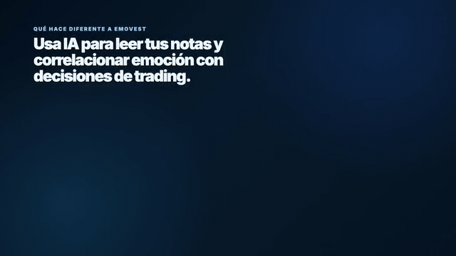

<p align="center">
  
</p>

<h1 align="center">📈 Opera con datos. Aprende de tus decisiones.</h1>

<p align="center">
  <strong>EmoVest</strong> es el diario de trading que conecta cada resultado con el contexto y las emociones que lo acompañaron.
</p>

<p align="center">
  <a href="https://github.com/ELROKA02/EmoVest/releases/latest/download/EmoVest-Setup.exe"></a>
  <a href="https://github.com/ELROKA02/EmoVest/releases/latest"></a>
</p>

<p align="center">
  
  
  
</p>

> ⚠️ EmoVest no da señales ni asesoramiento financiero. Es tu espacio para revisar, entender y mejorar tu propio proceso.

## ✨ Lo que nos diferencia

| Un diario de trading convencional | EmoVest |
| --- | --- |
| 📉 Registra precios y resultado | 🧠 Une resultado, confianza, notas y emociones en cada operación |
| 💰 Muestra una ganancia sin contexto | 💸 Calcula resultado bruto, comisión y beneficio neto por cuenta |
| 🗂️ Deja las capturas y motivos fuera | 📸 Guarda la operación con la imagen y la razón de tu decisión |
| 📊 Te dice qué ocurrió | 🔎 Te ayuda a descubrir **por qué se repiten** tus mejores y peores hábitos |
| ☁️ Impone una única forma de usar IA | 🤖 Tú eliges: IA local con Ollama o modelos remotos mediante OpenRouter |

### 🧠 No analices solo el mercado. Analízate también a ti.

El miedo, la euforia, la duda o el exceso de confianza no aparecen en la curva de capital. EmoVest los pone junto a tus estadísticas para que puedas revisar tu operativa con más perspectiva y menos memoria selectiva.

## 🚀 Todo tu proceso, en un solo lugar

- 📒 **Diario completo** — Operaciones LONG y SHORT, riesgo, confianza, notas y capturas.
- 💸 **Comisiones reales** — Tarifas fijas o porcentuales y resultado neto calculado automáticamente.
- 📊 **Estadísticas claras** — Beneficio neto, win rate, drawdown, rachas y rendimiento diario.
- 🧠 **Contexto emocional** — Analiza las notas de cada operación para detectar patrones de comportamiento.
- 💬 **EVA** — Conversa con tu diario para explorar tus hábitos de trading de forma más natural.
- 🔄 **Tus datos, sin ataduras** — Importa y exporta operaciones en CSV cuando lo necesites.

## 🔐 La IA se adapta a ti

| Si prefieres… | Puedes usar… |
| --- | --- |
| 🏠 Mantener el análisis en tu equipo | **Ollama** con un modelo local |
| 🌐 Conectar un modelo remoto | **OpenRouter** con tu propia API key |
| ⚙️ Combinar ambos enfoques | Un proveedor distinto para el análisis emocional y para EVA |

La IA es opcional: tus cuentas, operaciones y estadísticas funcionan aunque no configures ningún proveedor.

## 🍎 Instalar EmoVest en macOS

1. Descarga el archivo `.dmg` adecuado para tu Mac desde las [Releases de GitHub](https://github.com/ELROKA02/EmoVest/actions/runs/32899322503): `arm64` para Apple Silicon (M1 o posterior) o `x64` para Mac Intel.
2. Abre el archivo descargado y arrastra `EmoVest.app` a la carpeta **Aplicaciones**.
3. Abre EmoVest normalmente desde **Aplicaciones**.
4. Si macOS lo bloquea, ve a **Ajustes del Sistema → Privacidad y seguridad**, busca el aviso de EmoVest y pulsa **Abrir igualmente**. Confirma con tu contraseña o Touch ID si te lo solicita.
5. Vuelve a abrir EmoVest. Normalmente solo tendrás que confirmar este paso la primera vez.

Para saber por qué puede aparecer este aviso y consultar la alternativa avanzada solo si fuera necesaria, lee la [guía de instalación y seguridad](docs/instalacion-y-seguridad.md).

## 🪟 Instalación en Windows en 3 pasos

1. ⬇️ [Descarga EmoVest para Windows](https://github.com/ELROKA02/EmoVest/releases/latest/download/EmoVest-Setup.exe).
2. 🛠️ Ejecuta `EmoVest-Setup.exe` y completa el instalador.
3. 🎯 Crea una cuenta y registra tu próxima operación con todo su contexto.

No necesitas Python, Docker, MySQL, Redis ni Node.js. Tus datos se guardan fuera de la carpeta de instalación y se conservan al actualizar la aplicación.

## 🎬 EmoVest en acción

<p align="center">
  <a href="docs/Video_presentacion.mp4">
    
  </a>
</p>

<p align="center">
  🎥 <strong>Vista previa animada</strong> — pulsa la imagen para ver el vídeo completo.
</p>

## 🛠️ ¿Quieres saber cómo está hecho?

EmoVest combina una interfaz React, una aplicación de escritorio Tauri, una API local FastAPI y SQLite. Las tareas de IA se procesan en segundo plano para que registrar una operación nunca te frene.

👉 Consulta la [guía técnica de la edición de escritorio](docs/escritorio-windows.md) para conocer la arquitectura, la privacidad de la API local, las copias de seguridad, las actualizaciones y el entorno de desarrollo.

### 👩‍💻 Desarrollo local

```powershell
cd backend
python -m venv venv
.\venv\Scripts\python.exe -m pip install -r requirements.txt

cd ..
.\scripts\build-windows-sidecar.ps1

cd frontend
pnpm install
pnpm desktop:dev
```

## 🤝 Construyamos un trading más consciente

EmoVest es open source. Puedes proponer una mejora, informar de un problema o colaborar en experiencia de usuario, accesibilidad, privacidad, documentación y análisis responsable.

## ☕ Apoya EmoVest

Si EmoVest te ayuda a revisar tu operativa con más perspectiva, puedes contribuir a que el proyecto siga mejorando:

- **¿Tienes cuenta de GitHub?** [Patrocina EmoVest en GitHub Sponsors](https://github.com/sponsors/ELROKA02).
- **¿No tienes cuenta de GitHub?** [Invítame a un café en Buy Me a Coffee](https://buymeacoffee.com/elroka02).

Cada aportación ayuda a mantener y desarrollar este diario de trading open source.

## 📄 Licencia

EmoVest se publica bajo la [licencia MIT](LICENSE).


