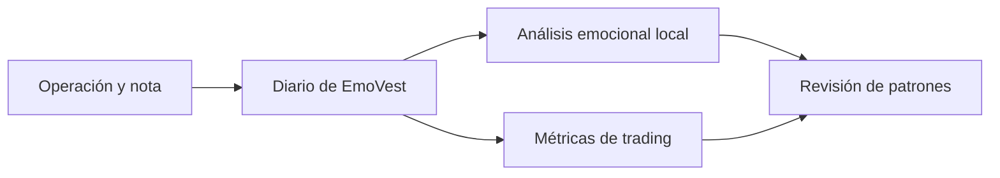
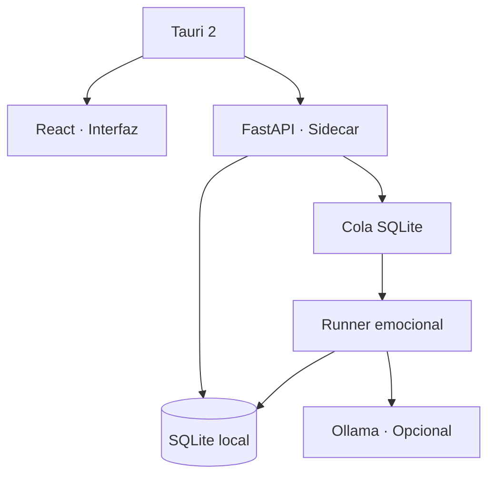

<p align="center">
  
</p>

<h1 align="center">EmoVest — entiende a la persona detrás de cada operación</h1>

<p align="center">
  Un diario de trading libre que conecta resultados, contexto y emociones para convertir cada operación en aprendizaje.
</p>

<p align="center">
  
  
  
</p>

> EmoVest no da señales ni asesoramiento financiero. Es un espacio para registrar, revisar y aprender de tu propia operativa.

## 🎬 EmoVest en acción

<video src="docs/Video_presentacion.mp4" controls preload="metadata">
  Tu navegador no puede reproducir este vídeo. Puedes verlo [aquí](docs/Video_presentacion.mp4).
</video>

---

## 🎯 El problema

Un histórico de operaciones explica qué ocurrió con el precio, pero rara vez explica qué ocurrió contigo. El miedo, la duda, la euforia o el exceso de confianza quedan en notas dispersas —cuando quedan registradas— y los mismos errores terminan pareciendo una mala racha más.

EmoVest reúne la operación y su contexto humano en el mismo lugar. Así puedes revisar patrones operativos y emocionales con evidencia, no solo con memoria.

## ⚡ Qué hace EmoVest

EmoVest es un diario de trading de escritorio para quien quiere operar con más reflexión. Registra cada operación, conserva su contexto y transforma las notas personales en indicadores emocionales orientativos mediante IA local.

| En vez de… | Con EmoVest puedes… |
|---|---|
| Revisar hojas de cálculo y notas sueltas | Ver operaciones, métricas y contexto en un mismo diario |
| Atribuir los errores a una sensación imprecisa | Comparar el resultado con la confianza y las emociones registradas |
| Entregar tus notas a servicios de terceros | Ejecutar el análisis con Ollama en tu propio entorno |

## 🧠 Cómo funciona

1. **Crea una cuenta de trading** y define su saldo y moneda.
2. **Registra la operación**: activo, entrada, salida, riesgo, resultado, nivel de confianza, notas y una captura opcional.
3. **Describe el contexto** con tus propias palabras. El análisis se procesa en segundo plano para no interrumpir tu flujo.
4. **Revisa tus patrones** con estadísticas de rendimiento, drawdown, rachas y contexto emocional.


```mermaid
flowchart LR
    A["Operación y nota"] --> B["Diario de EmoVest"]
    B --> C["Análisis emocional local"]
    B --> D["Métricas de trading"]
    C --> E["Revisión de patrones"]
    D --> E
```

El análisis emocional es una interpretación orientativa de tus notas; no sustituye tu criterio ni ofrece recomendaciones de inversión.

## 🚀 Funcionalidades

- Puedes crear y gestionar varias cuentas de trading.
- Puedes registrar operaciones LONG y SHORT con precios, cantidad, stop loss, take profit, resultado, relación riesgo-recompensa y confianza.
- Puedes añadir notas y una captura para conservar el contexto de cada decisión.
- Puedes consultar beneficio neto, win rate, drawdown, rachas y rendimiento por día.
- Puedes revisar cómo aparecen la confianza, duda, euforia, miedo y neutralidad junto a tus resultados.
- Puedes ejecutar el análisis emocional con IA local y mantener el control de tu entorno.
- Puedes consultar y editar la configuración del proveedor de IA desde la aplicación.

## 🛠️ Stack tecnológico

| Capa | Tecnología |
|---|---|
| Interfaz | React, Vite, Tailwind CSS y Recharts |
| API | FastAPI y SQLAlchemy |
| Escritorio | Tauri 2 y WebView2 |
| Datos | SQLite local |
| Procesamiento asíncrono | Cola persistente SQLite |
| IA emocional | Ollama y modelos locales |
| Autenticación | JWT |
| Instalador | NSIS (`EmoVest-Setup.exe`) |

## ⚙️ Empieza en minutos

### Aplicación de escritorio

EmoVest se instala en Windows con `EmoVest-Setup.exe`. El usuario no necesita
Python, Docker, MySQL ni Redis. La base de datos, las imágenes y las copias de
seguridad se guardan fuera de la carpeta de instalación y se conservan al
actualizar o reinstalar.

Ollama es opcional: si no está instalado, el diario y las estadísticas siguen
funcionando. EmoVest informa si falta el servicio o el modelo antes de intentar
un análisis.

### Desarrollo en Windows

```powershell
cd backend
python -m venv venv
venv\Scripts\activate
pip install -r requirements.txt
cd ..
.\scripts\build-windows-sidecar.ps1

cd frontend
pnpm install
pnpm desktop:dev
```

El instalador reproducible se genera con `pnpm desktop:build`. Consulta
[la guía de escritorio](docs/escritorio-windows.md) para rutas, migraciones,
backups, diagnóstico, updater y validación Windows.

## 🏗️ Arquitectura


```mermaid
flowchart TB
    T["Tauri 2"] --> UI["React · Interfaz"]
    T --> API["FastAPI · Sidecar"]
    API --> DB[("SQLite local")]
    API --> Q["Cola SQLite"]
    Q --> W["Runner emocional"]
    W --> AI["Ollama · Opcional"]
    W --> DB
```

El procesamiento emocional es asíncrono: recibir un `201` al crear una operación confirma que se ha guardado, no que el análisis ya haya terminado.

## 📚 Documentación y recursos

| Recurso | Contenido |
|---|---|
| [Edición de escritorio](docs/escritorio-windows.md) | Arquitectura, datos, backups, updater y validación |
| [Vídeo de presentación](docs/Video_presentacion.mp4) | Vista general del proyecto |

## 🤝 Contribuir

EmoVest mejora con personas que quieren hacer el trading más consciente y privado. Antes de abrir un cambio:

1. Revisa las [issues](../../issues) abiertas o plantea la idea en una nueva.
2. Mantén los cambios pequeños, documentados y centrados en un problema.
3. Ejecuta `pnpm lint` y `pnpm build` dentro de `frontend/` si modificas la interfaz.
4. Si tocas el flujo emocional, verifica la cola local, sus reintentos y la recuperación tras reinicio.

Las aportaciones que mejor encajan son mejoras de experiencia, accesibilidad, documentación, pruebas, privacidad y análisis responsable de patrones.

## 👥 Equipo

EmoVest es un proyecto abierto construido por una comunidad que cree que la disciplina también se puede medir. Si compartes esa visión, tus contribuciones son bienvenidas.

---

## ⚠️ Aviso

EMOVEST no proporciona asesoramiento financiero. Es una herramienta de analisis conductual y estadistico.

## 📄 Licencia

EmoVest se publica bajo [licencia MIT](LICENSE).
