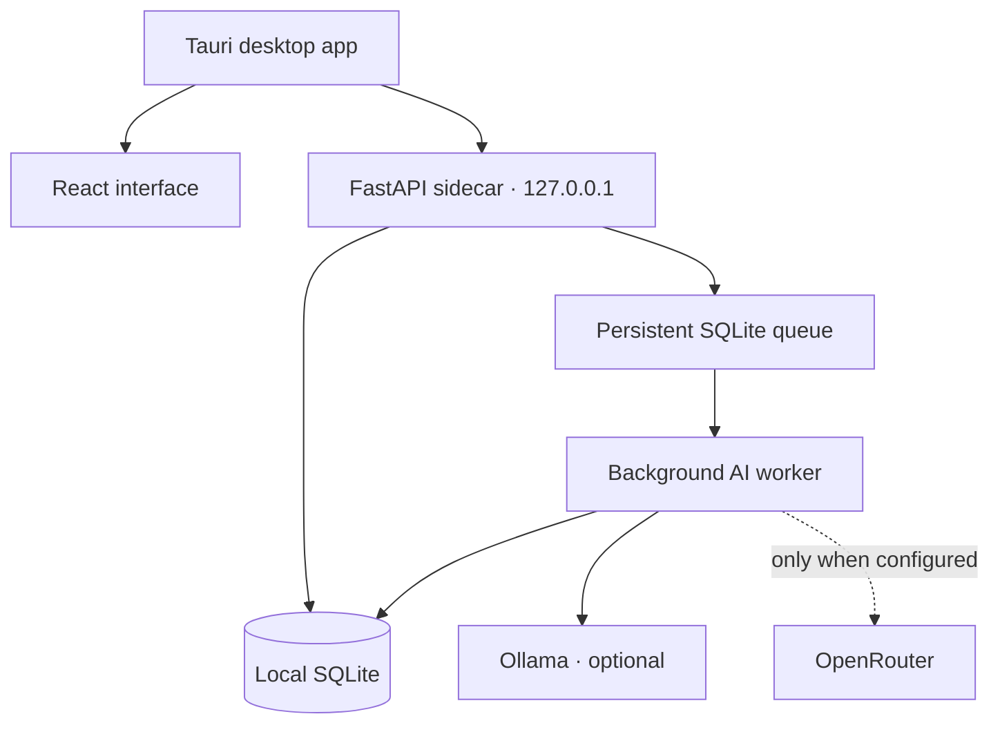

<p align="center">
  
</p>

<p align="center">
  <a href="README.md">English</a> · <a href="README.es.md">Español</a>
</p>

<h1 align="center">EmoVest</h1>

<p align="center">
  <strong>The open-source, local-first trading journal for understanding your performance, emotions, and trading behavior.</strong>
  <br>
  Understand not only how you trade, but why you trade the way you do.
</p>

<p align="center">
  <a href="https://github.com/ELROKA02/EmoVest/releases/latest/download/EmoVest-Setup.exe"></a>
  <a href="https://github.com/ELROKA02/EmoVest/releases/latest"></a>
</p>

<p align="center">
  <a href="https://github.com/ELROKA02/EmoVest/releases"></a>
  <a href="https://github.com/ELROKA02/EmoVest/actions/workflows/desktop-windows.yml"></a>
  <a href="LICENSE"></a>
  
  
</p>

> EmoVest does not provide trading signals or financial advice. It is a private space to review, understand, and improve your own process.

## See EmoVest in action

<p align="center">
  <a href="docs/Video_presentacion.mp4">
    
  </a>
</p>

<p align="center">
  <a href="docs/Video_presentacion.mp4">Watch the full product demo</a>
</p>

## Why EmoVest?

A trade history tells you what price did. It rarely tells you what happened to you: the fear, hesitation, euphoria, or overconfidence behind a decision.

EmoVest keeps the trade and its human context together. Review your results with evidence—not selective memory—and find the behavioral patterns that affect your process.

| Instead of… | With EmoVest you can… |
| --- | --- |
| Spreadsheets, broker history, and scattered notes | Keep trades, metrics, screenshots, and context in one journal |
| Treating every mistake as a bad streak | Compare results with your recorded confidence and emotional context |
| Sending sensitive notes to a default cloud service | Choose local analysis with Ollama or explicitly configure a remote provider |

## Built around your trading process

- **Complete journal** — Record LONG and SHORT trades, risk, confidence, notes, commissions, and screenshots.
- **Useful performance review** — Track net profit, win rate, drawdown, streaks, and daily performance per account.
- **Emotional context** — Turn trade notes into indicative emotional insights, always alongside the original trade data.
- **EVA** — Explore your journal and habits through a more natural conversation.
- **Your data, your choice** — Import and export CSV data when you need it.

## Your trading data belongs to you

| Area | How EmoVest handles it |
| --- | --- |
| Trades, screenshots, and statistics | Stored and calculated locally on your device |
| Database changes | Backups are created before migrations and remain outside the installation folder |
| Desktop API | Runs on `127.0.0.1` and uses a token generated for the desktop session |
| EVA with Ollama | Processed locally when you choose a local model |
| EVA with OpenRouter | Sent only when you explicitly configure OpenRouter and provide your own key |
| AI | Optional; the journal and statistics work without it |

The emotional analysis is an indicative interpretation of your notes. It supports reflection; it does not replace your judgment or provide investment recommendations.

## Choose how you use AI

| If you prefer… | You can use… |
| --- | --- |
| Analysis that stays on your machine | **Ollama** with a local model |
| A remote model you control | **OpenRouter** with your own API key |
| Different tools for different jobs | Separate providers for emotional analysis and EVA |

## Get started in three steps

1. [Download EmoVest for Windows](https://github.com/ELROKA02/EmoVest/releases/latest/download/EmoVest-Setup.exe).
2. Run `EmoVest-Setup.exe` and complete the installer.
3. Create an account and record your next trade with the context behind it.

You do not need Python, Docker, MySQL, Redis, or Node.js. Your data lives outside the installation folder and stays there when you update or reinstall EmoVest.

## Architecture


```mermaid
flowchart TB
    T["Tauri desktop app"] --> UI["React interface"]
    T --> API["FastAPI sidecar · 127.0.0.1"]
    API --> DB[("Local SQLite")]
    API --> Q["Persistent SQLite queue"]
    Q --> W["Background AI worker"]
    W --> O["Ollama · optional"]
    W -. "only when configured" .-> R["OpenRouter"]
    W --> DB
```

Creating a trade saves it first; emotional analysis runs in the background so your journal does not interrupt your workflow.

## Development

See [the Windows desktop guide](docs/escritorio-windows.md) for the architecture, data paths, backups, updates, and validation process.

```powershell
cd backend
python -m venv venv
.\venv\Scripts\python.exe -m pip install -r requirements.txt

cd ..
.\scripts\build-windows-sidecar.ps1

cd frontend
pnpm install
pnpm desktop:dev
```

## Roadmap and contributing

EmoVest is built in the open. Read the [public roadmap](ROADMAP.md), browse [open issues](https://github.com/ELROKA02/EmoVest/issues), and start with [CONTRIBUTING.md](CONTRIBUTING.md) when you are ready to help.

Contributions that improve the experience, accessibility, privacy, documentation, testing, or responsible analysis are especially welcome.

## Support EmoVest

If EmoVest helps you review your trading with more perspective, you can help keep the project moving:

- [Sponsor EmoVest on GitHub Sponsors](https://github.com/sponsors/ELROKA02)
- [Buy me a coffee](https://buymeacoffee.com/elroka02)

## License

EmoVest is released under the [MIT License](LICENSE).
