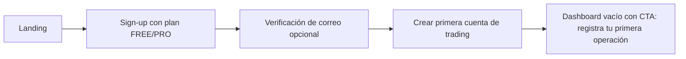
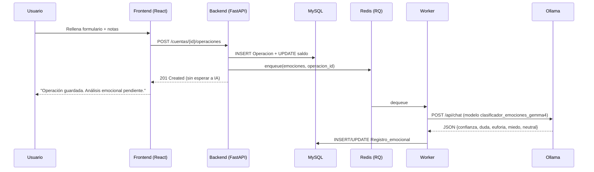
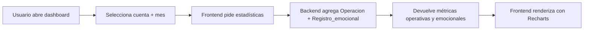
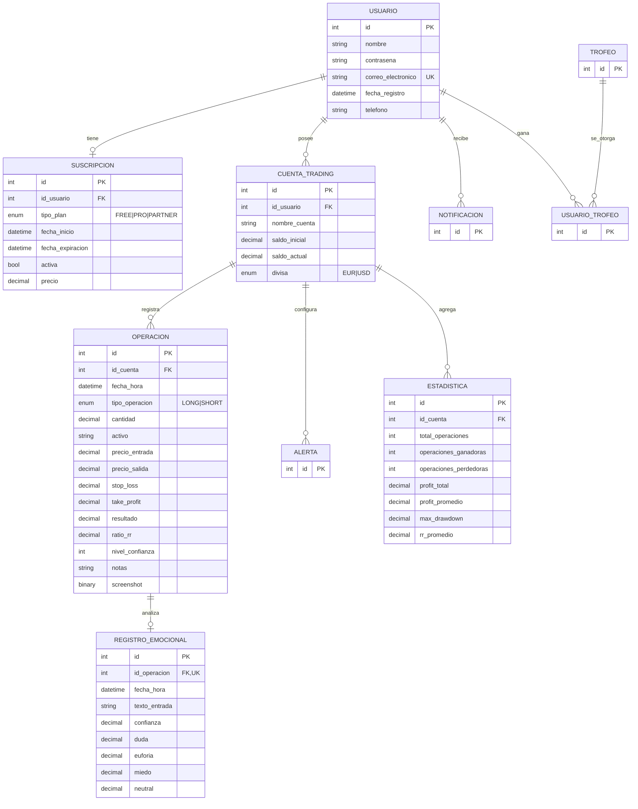

# PRD — EmoVest

> Product Requirements Document
> Plataforma de diario de trading con análisis emocional asistido por IA local.

---

## 0. Información del documento

| Campo | Valor |
|---|---|
| Producto | **EmoVest** |
| Versión del producto | 0.1.1 |
| Versión del PRD | 1.0 |
| Estado | Vigente — MVP en desarrollo |
| Fecha | 2026-05-14 |
| Autores | Equipo EmoVest (Annabel, Enrique, Alejandro, Samuel) |
| Repositorio | Monorepo (`backend/`, `frontend/`, `docs/`) |
| Documentos relacionados | [README.md](../README.md), [AGENTS.md](../AGENTS.md), [despliegue.md](despliegue.md), [redis-workers.md](redis-workers.md) |

---

## 1. Resumen ejecutivo

**EmoVest** es una aplicación web que convierte el diario de trading personal en *inteligencia emocional accionable*. Cada vez que un trader registra una operación con sus notas, un modelo de IA local cuantifica el estado emocional reflejado en el texto y lo vincula al resultado financiero real. El producto entrega al usuario un espejo psicológico de su operativa: qué emociones acompañan a sus mejores y peores decisiones.

A diferencia de un diario tradicional (que recoge precio, dirección, resultado y notas en texto libre), EmoVest:

1. Estructura el contexto operativo (stop-loss, take-profit, ratio R:R, nivel de confianza, screenshot).
2. Analiza las notas con un LLM local servido por Ollama y devuelve un vector de 5 emociones.
3. Cruza ese vector con el rendimiento para generar estadísticas emocionales agregadas por cuenta, mes y año.

El MVP se monetiza con un modelo freemium de suscripciones (`FREE`, `PRO`, `PARTNER`) y se despliega en un único VPS con Ollama preinstalado.

---

## 2. Problema y contexto

### 2.1. Problema

La mayoría de traders minoristas mide **precio y riesgo** pero no mide su **estado mental al decidir**. Sin ese dato:

- Los sesgos cognitivos (FOMO, aversión a las pérdidas, exceso de confianza tras una racha) quedan invisibles.
- El trader repite patrones destructivos disfrazados de "estrategia".
- Las herramientas existentes (diarios de papel, hojas de cálculo, journals como Edgewonk o Tradervue) tratan la emoción como texto libre, no como dato analizable.

### 2.2. Evidencia

- Estudios académicos (Lo, Repin, Steenbarger) muestran que la variabilidad de rendimiento del trader minorista se explica más por gestión emocional que por estrategia técnica.
- En entrevistas internas, el 100% del equipo fundador (y traders consultados) admiten escribir notas tras operar pero **no revisarlas sistemáticamente**.

### 2.3. Oportunidad

LLMs locales suficientemente buenos (Gemma, Llama, Mistral) ya pueden clasificar texto emocional en español con calidad usable, **sin enviar datos sensibles a una API externa**. Esto permite construir un producto privacy-first a coste de inferencia muy bajo.

---

## 3. Visión, misión y objetivos

### 3.1. Visión

> Convertir la disciplina emocional del trader en una métrica tan natural como el win-rate o el drawdown.

### 3.2. Misión (MVP)

Ofrecer una plataforma web donde un trader minorista pueda registrar sus operaciones con contexto completo y recibir, sin fricción, una lectura cuantitativa de su estado emocional vinculada al resultado de cada operación.

### 3.3. Objetivos del producto (12 meses)

| # | Objetivo | KPI | Meta |
|---|---|---|---|
| O1 | Lanzar MVP funcional en producción | Despliegue activo + uptime | ≥ 99 % mensual |
| O2 | Validar el ciclo emocional con usuarios reales | Operaciones registradas con notas | ≥ 60 % de las operaciones |
| O3 | Demostrar utilidad del análisis emocional | Usuarios que revisan dashboard ≥ 1×/semana | ≥ 40 % de activos |
| O4 | Construir base monetizable | Conversión a `PRO` | ≥ 5 % de cuentas activas |
| O5 | Mantener privacidad | Datos enviados a terceros para inferencia | **0** (todo es local) |

---

## 4. Alcance

### 4.1. Dentro del alcance (MVP — v0.1.x)

- Registro y autenticación de usuarios con JWT.
- Recuperación de contraseña por correo (SMTP).
- Gestión de múltiples cuentas de trading por usuario, con divisa EUR/USD.
- CRUD de operaciones (LONG/SHORT) con: activo, precios, cantidad, stop-loss, take-profit, notas, screenshot opcional y nivel de confianza (1–10).
- Recalculo automático de saldo de cuenta tras crear/editar/eliminar operación.
- Análisis emocional asíncrono de las notas con Ollama (modelo `clasificador_emociones_gemma4`), 5 emociones: **confianza, duda, euforia, miedo, neutral**.
- Estadísticas por cuenta y por mes: total operaciones, ganadoras/perdedoras, profit total y promedio, drawdown máximo, ratio R:R promedio.
- Dashboard de rendimiento mensual y panel emocional.
- Suscripciones (`FREE`, `PRO`, `PARTNER`) con fecha de inicio/expiración.
- Notificaciones in-app.
- Trofeos como gamificación ligera.

### 4.2. Fuera del alcance (MVP)

- Conexión automática con brokers (importación vía API o CSV de MT4/MT5/IBKR).
- Cotizaciones en tiempo real / market data.
- Multi-divisa más allá de EUR/USD.
- Aplicaciones móviles nativas.
- Análisis de sentimiento de noticias o redes sociales.
- Trading social, copy-trading o señales.
- Asesoramiento financiero (queda excluido por aviso legal explícito).

### 4.3. Supuestos

- El usuario opera manualmente y registra cada operación al cierre.
- El VPS tiene Ollama instalado y al menos el modelo `clasificador_emociones_gemma4` disponible.
- El usuario está dispuesto a escribir notas en español (el prompt y el modelo están afinados para ese idioma).

---

## 5. Personas y casos de uso

### 5.1. Personas

**P1 — María, trader minorista part-time (32 años).**
Opera índices y forex 1–2 horas por la tarde. Lleva diario en una hoja Excel desordenada. Sospecha que sus peores días coinciden con "estar acelerada" pero no lo puede probar. Espera un sistema que le dé esa prueba sin sobrecargarla con campos.

**P2 — Carlos, trader serio en formación (24 años).**
Estudia price action, opera con cuenta demo y una pequeña cuenta real. Quiere construir buenos hábitos desde el principio: un journal que mida tanto operativa como psicología. Valora la gamificación.

**P3 — Daniel, prop-firm challenger (29 años).**
Persigue financiación de una firma propietaria. Necesita un journal con drawdown, R:R y win-rate calculados automáticamente, y quiere entender en qué estado emocional rompe sus reglas.

**P4 — Mentor / coach de trading (P4 — futuro plan `PARTNER`).**
Sigue a varios alumnos. Quiere ver dashboards agregados para detectar problemas emocionales recurrentes.

### 5.2. Casos de uso principales

| ID | Caso de uso | Persona | Prioridad |
|---|---|---|---|
| UC-01 | Crear cuenta personal y suscribirse a plan | P1, P2, P3 | Must |
| UC-02 | Crear cuenta de trading con saldo inicial | P1, P2, P3 | Must |
| UC-03 | Registrar operación cerrada con notas | P1, P2, P3 | Must |
| UC-04 | Editar operación abierta (añadir cierre) | P1, P2, P3 | Must |
| UC-05 | Ver dashboard de rendimiento mensual | P1, P2, P3 | Must |
| UC-06 | Ver panel emocional cruzado con resultado | P1, P2, P3 | Must |
| UC-07 | Recuperar contraseña | Todos | Must |
| UC-08 | Adjuntar screenshot del gráfico | P2, P3 | Should |
| UC-09 | Filtrar estadísticas por mes/año/cuenta | P1, P2, P3 | Should |
| UC-10 | Obtener trofeos por hitos | P2 | Could |
| UC-11 | Visualizar alumnos (plan `PARTNER`) | P4 | Won't (MVP) |

---

## 6. Propuesta de valor y diferenciación

### 6.1. Propuesta de valor

> *"El primer diario de trading que mide qué siente tu cabeza cuando aprietas el botón, y te lo cruza con cuánto ganas o pierdes."*

### 6.2. Comparativa

| Aspecto | Diarios tradicionales (Edgewonk, Tradervue, Excel) | EmoVest |
|---|---|---|
| Registro operacional | Sí | Sí, con contexto emocional y operativo extra (SL/TP/confianza) |
| Captura del estado mental | Texto libre o no se registra | Texto libre **+ cuantificación con IA local** |
| Vínculo emoción ↔ resultado | Manual, depende del usuario | Automático, agregado por mes y emoción |
| Métricas avanzadas | Profit, win-rate | Profit, win-rate, drawdown, rachas, días buenos/malos, **emocionales** |
| Privacidad del texto emocional | Datos en servidores del proveedor | **Inferencia local con Ollama, sin terceros** |
| Coste de inferencia | N/A o API externa | Cero variable, sólo CPU/GPU propia |

### 6.3. Por qué ahora

- LLMs locales abiertos han alcanzado calidad suficiente para clasificación textual en español.
- Hostinger y otros proveedores ofrecen VPS con Ollama preinstalado, eliminando la fricción de despliegue.
- La conciencia de privacidad del usuario crece: el trader no quiere que su confesión emocional viaje a un proveedor externo.

---

## 7. Funcionalidades detalladas

> Cada feature lleva: descripción, user stories y criterios de aceptación. Los endpoints citados corresponden a los routers existentes en `backend/routers/`.

### F1. Registro y autenticación

**Descripción.** Sign-up y login con correo + contraseña. JWT en cabecera Authorization. Sesión persistente. Recuperación de contraseña por enlace expirante (30 min).

**User stories.**
- US-1.1 Como visitante, quiero crear una cuenta con correo y contraseña para acceder a la plataforma.
- US-1.2 Como usuario, quiero permanecer logueado entre visitas para no repetir credenciales.
- US-1.3 Como usuario, quiero solicitar un enlace de recuperación si olvido la contraseña.

**Criterios de aceptación.**
- [ ] La contraseña se guarda con bcrypt; nunca en claro.
- [ ] El JWT incluye `sub` (id de usuario) y `exp` (480 minutos por defecto).
- [ ] El correo de recuperación lleva un token firmado con TTL de 30 min y un solo uso.
- [ ] Si el correo solicitado no existe, la API responde el mismo mensaje genérico (no enumera usuarios).

**Endpoints relevantes.** `routers/auth.py` (`POST /signup`, `POST /login`, `POST /password-reset/request`, `POST /password-reset/confirm`).

---

### F2. Gestión de cuentas de trading

**Descripción.** Un usuario puede tener N cuentas de trading (estrategias o brokers distintos). Cada cuenta tiene nombre, fecha de creación, saldo inicial, saldo actual y divisa (`EUR` | `USD`).

**User stories.**
- US-2.1 Como usuario, quiero crear cuentas de trading para separar estrategias.
- US-2.2 Como usuario, quiero editar el nombre y saldo inicial de una cuenta.
- US-2.3 Como usuario, quiero eliminar una cuenta que ya no uso.

**Criterios de aceptación.**
- [ ] Las cuentas están aisladas por `id_usuario`; la API rechaza con `404` accesos cruzados.
- [ ] Al crear una cuenta, `saldo_actual = saldo_inicial`.
- [ ] Eliminar una cuenta elimina en cascada sus operaciones, estadísticas y alertas (o las bloquea — decisión técnica en backend).
- [ ] No se permite cambiar la divisa de una cuenta con operaciones registradas (decisión congelada por integridad contable).

**Endpoints.** `routers/cuentaTrading.py`.

---

### F3. Registro de operaciones (diario)

**Descripción.** Operaciones LONG o SHORT con todos los campos relevantes para un journal serio. Soporta fase abierta (sin `precio_salida`) y cierre posterior.

**Campos.**

| Campo | Tipo | Obligatorio | Notas |
|---|---|---|---|
| `fecha_hora` | datetime | Sí | Momento de apertura |
| `tipo_operacion` | enum LONG/SHORT | Sí | |
| `activo` | string(10) | Sí | Ticker o símbolo (p.ej. `EURUSD`) |
| `cantidad` | decimal(20,6) | Sí | Lotes / unidades |
| `precio_entrada` | decimal(20,6) | Sí | |
| `precio_salida` | decimal(20,6) | No | Si nulo, operación abierta |
| `stop_loss` | decimal(20,6) | No | |
| `take_profit` | decimal(20,6) | No | |
| `resultado` | decimal(20,6) | No | Se calcula o se informa manualmente |
| `ratio_rr` | decimal(10,4) | No | Riesgo:Recompensa |
| `nivel_confianza` | int 1–10 | No | Auto-reportado por el trader |
| `notas` | string(255) | No | **Disparador del análisis emocional** |
| `screenshot` | binary | No | Imagen del gráfico |

**User stories.**
- US-3.1 Como usuario, quiero registrar una operación con todos sus campos para tener un journal completo.
- US-3.2 Como usuario, quiero adjuntar una captura del gráfico para revisar el contexto visual.
- US-3.3 Como usuario, quiero editar `precio_salida` y `resultado` para cerrar una operación que dejé abierta.
- US-3.4 Como usuario, quiero eliminar operaciones erróneas y que el saldo se recalcule.

**Criterios de aceptación.**
- [ ] Al crear/editar operación con notas no vacías, se encola un job en Redis para clasificar emociones (no bloquea la respuesta HTTP).
- [ ] El saldo de la cuenta se actualiza dentro de la misma transacción que la operación.
- [ ] Eliminar una operación revierte su impacto en el saldo.
- [ ] El screenshot acepta JPG/PNG con tamaño razonable (límite por confirmar en implementación).

**Endpoints.** `routers/operaciones.py` (`GET/POST/PUT/DELETE /cuentas/{id}/operaciones`).

---

### F4. Análisis emocional con IA local

**Descripción.** Es el corazón diferencial del producto. Cuando una operación se guarda con `notas`, el backend encola un job RQ (cola `emociones`). El worker invoca al modelo `clasificador_emociones_gemma4:latest` vía Ollama en `127.0.0.1:11434`. El modelo devuelve un JSON con 5 valores de 0 a 100 que suman 100. Se persiste como `Registro_emocional` (uno por operación, relación 1:1).

**Las cinco emociones.**

| Emoción | Significado operativo |
|---|---|
| `confianza` | Decisión planificada, alineada con sistema, baja ansiedad |
| `duda` | Indecisión, conflicto entre análisis y ejecución |
| `euforia` | Exceso, sensación de invulnerabilidad — bandera roja tras una racha |
| `miedo` | Aversión, parálisis o cierre prematuro |
| `neutral` | Disciplina pura, ausencia de carga emocional |

**User stories.**
- US-4.1 Como usuario, quiero que mis notas se analicen automáticamente para ver mi estado emocional.
- US-4.2 Como usuario, quiero ver el resultado del análisis junto a cada operación.
- US-4.3 Como usuario, quiero que el análisis ocurra sin bloquear la creación de la operación.

**Criterios de aceptación.**
- [ ] Si Ollama no responde, la operación se guarda igualmente y `Registro_emocional` queda con ceros (no se rompe el flujo).
- [ ] El job se reintenta hasta `RQ_RETRY_MAX = 3` veces con backoff `[2, 4, 8]` s.
- [ ] Los valores almacenados son `decimal(3,2)` entre 0.00 y 1.00 (proporciones, no porcentajes).
- [ ] El frontend muestra el registro emocional cuando existe; si está pendiente, indica "Procesando" sin bloquear la UI.

**Componentes.** `backend/routers/ia.py`, `backend/rq_queue.py`, `backend/worker.py`, `backend/jobs/`.

**Detalles del prompt** — vive en `routers/ia.py::construir_prompt_emociones`. Pide JSON estricto, 5 claves obligatorias, valores entre 0 y 100 con dos decimales, suma exacta = 100. La validación de respuesta usa Pydantic (`Emociones`).

---

### F5. Estadísticas y dashboard

**Descripción.** Métricas calculadas por cuenta y por mes, persistidas en `Estadistica` (cálculo posiblemente bajo demanda o materializado).

**Métricas operativas.**

| Métrica | Fórmula |
|---|---|
| `total_operaciones` | count(operaciones cerradas) |
| `operaciones_ganadoras` | count(resultado > 0) |
| `operaciones_perdedoras` | count(resultado < 0) |
| `win_rate` | ganadoras / total_operaciones |
| `profit_total` | sum(resultado) |
| `profit_promedio` | profit_total / total_operaciones |
| `max_drawdown` | máximo descenso desde un pico de equity |
| `rr_promedio` | media(ratio_rr) sobre operaciones con valor |
| `racha_ganadora` | mayor secuencia consecutiva con resultado > 0 |
| `racha_perdedora` | mayor secuencia consecutiva con resultado < 0 |
| `dia_mas_rentable` | día de la semana con mayor profit promedio |

**Métricas emocionales (panel emocional).**

| Métrica | Cálculo |
|---|---|
| Emoción dominante mensual | argmax sobre la media de las 5 dimensiones del mes |
| Win-rate por emoción dominante | win-rate restringido a operaciones cuya emoción dominante = X |
| Profit total por emoción dominante | sum(resultado) por emoción dominante |
| Correlación emoción ↔ resultado | (post-MVP) correlación de Pearson por dimensión |

**User stories.**
- US-5.1 Como usuario, quiero ver mi rendimiento del mes para entender cómo voy.
- US-5.2 Como usuario, quiero filtrar por mes y año para detectar evolución.
- US-5.3 Como usuario, quiero ver qué emoción acompaña mis mejores y peores resultados.

**Endpoints.** `routers/estadisticas.py`.

---

### F6. Suscripciones (monetización)

**Descripción.** Cada usuario tiene exactamente una suscripción activa (`uselist=False` en el modelo). Tres planes con fecha de inicio y expiración y un precio asociado.

| Plan | Público | Cuentas | IA emocional | Roadmap |
|---|---|---|---|---|
| `FREE` | Onboarding y curiosos | 1 cuenta | Limitada (p.ej. 30 análisis/mes) | Siempre disponible |
| `PRO` | Trader serio | Ilimitadas | Ilimitada | Suscripción mensual de pago |
| `PARTNER` | Mentores / B2B | Multi-cuenta + vista agregada | Ilimitada | Versión post-MVP |

**Criterios de aceptación.**
- [ ] No se permite registro sin elegir plan (`tipo_plan` obligatorio en `SignUp`).
- [ ] Sólo un registro activo por usuario (`unique` sobre `id_usuario`).
- [ ] El precio se conserva en el momento de la suscripción (snapshot, para histórico contable).
- [ ] La expiración no caduca la cuenta del usuario: degrada a `FREE`.

---

### F7. Notificaciones in-app

**Descripción.** Mensajes vinculados al usuario, marcables como leídos. Disparados por eventos del sistema (suscripción próxima a expirar, hito alcanzado, error en análisis emocional, etc.).

**Criterios de aceptación.**
- [ ] La lista de notificaciones es paginable.
- [ ] Marcar como leída es idempotente.
- [ ] Las notificaciones no son críticas; pérdida tolerable.

---

### F8. Trofeos (gamificación ligera)

**Descripción.** Sistema de logros (`trofeos`) y asignación a usuario (`usuario_trofeo`).

**Ejemplos de trofeos sugeridos.**
- *Primer paso* — primera operación registrada.
- *Reflexivo* — 10 operaciones con notas.
- *Disciplina* — 30 días seguidos con al menos una operación registrada.
- *Caza-sesgos* — 5 operaciones consecutivas con emoción dominante = `neutral` y resultado positivo.

**Criterios de aceptación.**
- [ ] Los trofeos son retro-aplicables: al añadir un trofeo nuevo, el backend escanea cumplimientos pasados (decisión a confirmar).
- [ ] Cada par `(usuario, trofeo)` es único.

---

## 8. Flujos principales

### 8.1. Onboarding



### 8.2. Registro de operación con análisis emocional



Notas:

- La respuesta `201` **no implica** que el análisis emocional esté listo. Es comportamiento esperado (ver AGENTS.md §Pitfalls).
- Si el worker o Redis caen, el registro emocional queda en cero y el resto del flujo no se ve afectado.

### 8.3. Visualización de panel emocional



---

## 9. Modelo de datos

> Fuente de verdad: `backend/models.py`. Diagrama lógico simplificado.



**Reglas de integridad clave.**

- `Suscripcion.id_usuario` es `unique` → 1:1.
- `Registro_emocional.id_operacion` es `unique` → 1:1.
- `Cuenta_Trading.divisa` está restringida a `EUR` o `USD`.
- `Usuario.correo_electronico` es `unique` e indexado.

---

## 10. API (resumen)

> El detalle está en Swagger UI generado automáticamente por FastAPI en `/docs`. Estos son los grupos.

| Tag | Router | Propósito |
|---|---|---|
| `usuarios` | `routers/auth.py` | Sign-up, login, refresh, recuperación de contraseña |
| `cuentas` | `routers/cuentaTrading.py` | CRUD de cuentas de trading |
| `operaciones` | `routers/operaciones.py` | CRUD de operaciones (sub-recurso de cuenta) |
| `emociones` | `routers/ia.py` | Clasificación y consulta del registro emocional |
| `estadisticas` | `routers/estadisticas.py` | Métricas agregadas por cuenta/mes/año |
| `suscripciones` | `routers/suscripciones.py` | Gestión del plan del usuario |
| `otros` | `app.py` | Healthcheck (`GET /`) |

**Convenciones.**

- Autenticación: `Bearer <JWT>` en cabecera `Authorization` salvo endpoints públicos (`/signup`, `/login`, recuperación).
- Errores: `401` no autenticado, `403` autenticado sin permiso, `404` recurso no propio o inexistente, `422` validación Pydantic.
- Sub-recursos: `/cuentas/{cuenta_id_trading}/operaciones/...`.
- CORS: durante desarrollo se aceptan `localhost:5173` y `5174`.

---

## 11. Análisis emocional — especificación detallada

### 11.1. Pipeline

1. El usuario crea o edita una operación con `notas` no vacías.
2. El endpoint llama a `enqueue_emociones_job(operacion_id, texto)`.
3. RQ encola en la cola `emociones` (Redis `db 0`).
4. `worker.py` (SimpleWorker en macOS/Linux por compatibilidad local) toma el job.
5. El worker llama a `clasificar_emociones(texto)`:
   - Construye el prompt con `construir_prompt_emociones`.
   - Llama a `ollama.chat(model=clasificador_emociones_gemma4:latest, format=Emociones.schema)`.
   - Valida la respuesta con Pydantic `Emociones`.
6. El worker llama a `guardar_registro_emocional` que hace upsert (1:1 con operación).
7. Los valores se almacenan **como proporciones (0.00–1.00)**, dividiendo los porcentajes del modelo por 100.

### 11.2. Política de fallos

| Escenario | Comportamiento |
|---|---|
| `ollama` no instalado en Python | Se persiste el registro con todos los valores a 0. |
| Ollama HTTP no responde | El worker registra advertencia, deja valores a 0. |
| Respuesta no parseable como JSON válido | `ValueError` → job falla, RQ reintenta hasta 3 veces (`[2,4,8]`s). |
| Suma de porcentajes ≠ 100 ± tolerancia | Aceptado por ahora; el modelo devuelve aproximaciones. Tolerancia explícita queda en el roadmap. |
| Texto vacío o demasiado corto (< 3 caracteres) | No se encola job; el registro emocional no se crea. |

### 11.3. Calibración del modelo

- Modelo base: `gemma` (familia de Google), customizado vía `Modelfile` como `clasificador_emociones_gemma4`.
- Idioma objetivo: español neutro.
- Evaluación interna pendiente: dataset etiquetado a mano (50–100 notas reales) con métricas de macro-F1 por emoción.

---

## 12. Requisitos no funcionales

| Categoría | Requisito |
|---|---|
| **Rendimiento** | P95 < 300 ms en endpoints CRUD; análisis emocional asíncrono con SLA < 30 s desde encolado |
| **Disponibilidad** | ≥ 99 % mensual; degradación elegante si Ollama o Redis caen |
| **Seguridad** | JWT firmado HS256; bcrypt para contraseñas; HTTPS obligatorio en prod (certbot); sólo `nginx` expuesto a Internet |
| **Privacidad** | Inferencia 100 % local; ningún texto de usuario sale del VPS; backups cifrados |
| **Escalabilidad** | MVP en un único VPS (ver `docs/despliegue.md §11` para señales de cuándo replantear) |
| **Accesibilidad** | UI cumple WCAG 2.1 nivel AA (objetivo, no auditado aún) |
| **Internacionalización** | UI 100 % en español en el MVP; arquitectura preparada para añadir i18n |
| **Observabilidad** | Logs vía `journalctl` de `emovest-api`, `emovest-worker`, `nginx`, `ollama` |
| **Backup** | Dump diario de MySQL con rotación; copia fuera del VPS recomendada |
| **Cumplimiento** | RGPD: derecho de acceso y borrado del usuario; aviso legal explícito sobre que el producto **no es asesoramiento financiero** |

---

## 13. Arquitectura y stack

### 13.1. Diagrama de despliegue

```
              Internet
                 │
                 ▼
            ┌────────┐
            │ nginx  │  :80 / :443
            └───┬────┘
       ┌────────┴────────┐
       ▼                 ▼
  /api/*           /  → frontend/dist (estático)
  uvicorn :8000
       │
   ┌───┼─────────────────────┐
   ▼   ▼                     ▼
 MySQL Redis :6379    Ollama :11434
 :3306    │
          ▼
       RQ Worker (python worker.py)
```

Sólo `nginx` está expuesto a Internet. Todo lo demás escucha en `127.0.0.1`.

### 13.2. Stack tecnológico

| Capa | Tecnología | Notas |
|---|---|---|
| Frontend | React 19 + Vite 8 + Tailwind CSS 4 | SPA, build estática |
| Routing FE | React Router 7 | |
| Cliente HTTP | axios | |
| Gráficos | Recharts | |
| Calendario | FullCalendar | |
| Backend | FastAPI + uvicorn (2 workers) | Python 3.11+ |
| ORM | SQLAlchemy 2.0 | |
| DB | MySQL 8 (PyMySQL) | |
| Cola | Redis + RQ | `SimpleWorker` en dev por compatibilidad macOS/Linux |
| IA | Ollama, modelo `clasificador_emociones_gemma4` | inferencia local |
| Auth | JWT (python-jose) + bcrypt (passlib) | HS256 |
| Validación | Pydantic v2 | |
| Email | SMTP (smtplib + EmailMessage) | recuperación de contraseña |
| Servicio | `systemd` × 5 servicios | ver `docs/despliegue.md §8` |

### 13.3. Límites de responsabilidades (de `AGENTS.md`)

- HTTP en `backend/routers/`.
- ORM en `backend/models.py`.
- Cola en `backend/rq_queue.py`, jobs en `backend/jobs/`.
- Inferencia en `backend/routers/ia.py`.

---

## 14. Seguridad

- Contraseñas con bcrypt (factor por defecto).
- JWT HS256 con `SECRET_KEY` desde entorno (`.env`).
- Expiración por defecto 480 minutos.
- Recuperación de contraseña: token firmado JWT con `exp = 30 min` y propósito específico.
- CORS restringido en producción al dominio del frontend (en dev sólo `localhost`).
- Inputs validados con Pydantic; SQLAlchemy parametrizado (sin SQL crudo).
- Subida de imágenes: el screenshot se guarda como `LargeBinary` en MySQL. Decisión pendiente de revisar: a partir de cierto volumen, mover a almacenamiento de objetos.

### Riesgos abiertos (security)

- `screenshot` como `LargeBinary` infla el tamaño de la base. Mitigación recomendada: límite de tamaño (≤ 1 MB) y, en una v2, mover a object storage.
- No hay rate-limit en `/login` ni en recuperación de contraseña → vulnerable a brute force y enumeración. Añadir en hardening pre-producción.
- CORS abierto a `*` en métodos y cabeceras durante dev; restringir en prod.

---

## 15. Privacidad y RGPD

- **Inferencia 100 % local**: las notas del usuario no salen del VPS.
- **Datos personales tratados**: nombre, correo, teléfono (opcional), historial operativo, texto emocional libre.
- **Base legal**: ejecución de contrato (servicio solicitado) + consentimiento explícito para análisis emocional.
- **Derechos del usuario**: acceso, rectificación, borrado, portabilidad. Implementación en endpoint dedicado del plan post-MVP.
- **Retención**: mientras la cuenta esté activa. Tras borrado: 30 días antes de purga definitiva (backup incluido).
- **Aviso legal**: EmoVest **no proporciona asesoramiento financiero**. Es una herramienta de análisis conductual y estadístico.

---

## 16. Monetización

| Plan | Precio (orientativo) | Limites | Soporte |
|---|---|---|---|
| `FREE` | 0 € | 1 cuenta de trading, 30 análisis emocionales / mes | Comunidad |
| `PRO` | ~10 €/mes | Ilimitado | Email |
| `PARTNER` | A definir (B2B) | Multi-alumno, dashboard agregado | Onboarding personalizado |

**Notas.**

- El precio actual no está fijado en producto; la decisión la toma el equipo en base a pruebas pre-lanzamiento.
- El upgrade de plan se hace dentro de la app con pasarela de pago (Stripe, candidato natural — fuera del alcance del MVP funcional).

---

## 17. Métricas de éxito (KPIs)

### 17.1. Producto

| Métrica | Definición | Objetivo MVP (90 días post-lanzamiento) |
|---|---|---|
| Usuarios registrados | Cuentas creadas | 500 |
| Usuarios activos semanales (WAU) | Login + ≥ 1 acción | 100 |
| Operaciones registradas | Total acumulado | 5.000 |
| % operaciones con notas | (ops con notas) / total | ≥ 60 % |
| Análisis emocionales generados | Registros emocionales con suma > 0 | ≥ 80 % de los esperados |
| Conversión FREE → PRO | upgrades / FREE activos | ≥ 5 % |
| Churn mensual de PRO | bajas / PRO activos | < 8 % |

### 17.2. Técnicas

| Métrica | Objetivo |
|---|---|
| Disponibilidad de `emovest-api` | ≥ 99 % |
| Latencia P95 endpoints CRUD | < 300 ms |
| Tiempo medio análisis emocional | < 10 s |
| Jobs fallidos / total | < 2 % |
| MTBF Ollama (tiempos sin caída) | ≥ 7 días |

---

## 18. Roadmap

### v0.1.x — MVP (actual)

- [x] Auth + recuperación de contraseña
- [x] CRUD cuentas y operaciones
- [x] Cola RQ + worker emocional
- [x] Modelo `clasificador_emociones_gemma4` en Ollama
- [x] Dashboard básico
- [ ] Panel emocional pulido
- [ ] Trofeos básicos
- [ ] Pasarela de pago para `PRO`

### v0.2 — Polish (siguiente)

- Auditoría de seguridad (rate-limit, secrets rotation).
- Calibración del modelo con dataset propio + métricas macro-F1.
- Tests automatizados (backend con pytest, frontend con Vitest).
- Mover screenshots a almacenamiento de objetos.
- Internacionalización (inglés).

### v0.3 — Crecimiento

- Importación CSV de operaciones desde MT4 / MT5 / IBKR.
- Plan `PARTNER`: dashboard de mentor con N alumnos.
- Notificaciones por correo (resumen semanal).
- Detección de patrones (operaciones repetidas en estado `euforia` post-ganadora).

### v0.4 — Plataforma

- API pública para integraciones de terceros.
- Webhooks.
- Versión móvil (PWA o nativa).

---

## 19. Riesgos y mitigación

| Riesgo | Probabilidad | Impacto | Mitigación |
|---|---|---|---|
| El LLM local clasifica mal en español | Media | Alto | Dataset propio + Modelfile afinado; calibración trimestral |
| Ollama satura el VPS bajo carga | Media | Alto | Cola con timeout y reintentos; señal documentada para mover Ollama a GPU dedicada (`docs/despliegue.md §11`) |
| El usuario no escribe notas | Alta | Alto | UX que invite a escribir; gamificación con trofeos por notas; prompts contextuales |
| Brecha de privacidad (acceso a texto sensible) | Baja | Crítico | Inferencia 100 % local; cifrado at-rest en backups; revisión de logs para no filtrar texto |
| Competidor con misma propuesta (ej. Edgewonk añade IA) | Media | Medio | Diferenciador *privacy-first + español* + comunidad |
| Aviso de regulador por confusión con asesoramiento financiero | Baja | Alto | Aviso legal explícito en home, footer y onboarding; términos y condiciones |
| Sobrecarga del modelo `LargeBinary` en MySQL por screenshots | Media | Medio | Límite de tamaño + plan de migración a object storage en v0.2 |
| Pérdida del modelo de Ollama (desinstalación, cambio de versión) | Baja | Alto | `Modelfile` versionado en el repo; reproducible con `ollama create` |

---

## 20. Cumplimiento legal y consideraciones

- **No asesoramiento financiero**: aviso visible (footer, signup, página de operación).
- **Términos y condiciones** y **política de privacidad**: páginas dedicadas en frontend, enlace en footer.
- **Cookies**: banner de consentimiento (analítica opcional, no marketing en MVP).
- **Edad mínima**: 18 años (limite de operaciones financieras en la mayoría de jurisdicciones).
- **Backups y derecho al olvido**: ciclo de vida documentado.

---

## 21. Equipo

| Nombre | Rol | GitHub |
|---|---|---|
| Annabel | Frontend | @Annabel707 |
| Enrique | Frontend | @3gr00 |
| Alejandro | Backend | @21AlexMedina |
| Samuel | Backend | @ELROKA02 |

---

## 22. Glosario

| Término | Definición |
|---|---|
| Diario de trading | Registro sistemático de operaciones para revisión posterior. |
| LONG / SHORT | Posición compradora / vendedora. |
| Stop-loss (SL) | Precio al que se cierra automáticamente una posición para limitar pérdida. |
| Take-profit (TP) | Precio al que se cierra automáticamente una posición para asegurar ganancia. |
| Ratio R:R | Riesgo:Recompensa, distancia hasta SL vs distancia hasta TP. |
| Drawdown | Mayor descenso desde un pico de equity. |
| Win-rate | % de operaciones ganadoras sobre el total. |
| Racha | Serie consecutiva de operaciones ganadoras o perdedoras. |
| FOMO | *Fear Of Missing Out*; sesgo emocional de entrar tarde por miedo a perder oportunidad. |
| LLM | *Large Language Model*. |
| Ollama | Runtime local de LLMs (`http://localhost:11434`). |
| RQ | *Redis Queue*, biblioteca de colas en Python. |
| JWT | *JSON Web Token*, mecanismo de sesión sin estado. |

---

## 23. Anexos

### 23.1. Fuentes de verdad y enlaces internos

- Despliegue: [docs/despliegue.md](despliegue.md)
- Cola Redis y workers: [docs/redis-workers.md](redis-workers.md)
- Guía para agentes de código: [AGENTS.md](../AGENTS.md)
- Modelos ORM: [backend/models.py](../backend/models.py)
- Schemas Pydantic: [backend/schemas.py](../backend/schemas.py)
- Router IA: [backend/routers/ia.py](../backend/routers/ia.py)
- Configuración: [backend/config.py](../backend/config.py)

### 23.2. Convenciones del documento

- Toda fecha en formato `AAAA-MM-DD`.
- Toda cifra monetaria con dos decimales y divisa explícita.
- Las palabras **Must / Should / Could / Won't** siguen MoSCoW.
- Los identificadores entre backticks corresponden a nombres reales en el código.

### 23.3. Histórico de cambios del PRD

| Versión | Fecha | Cambios |
|---|---|---|
| 1.0 | 2026-05-14 | Versión inicial alineada con el estado actual del repo (v0.1.1). |
